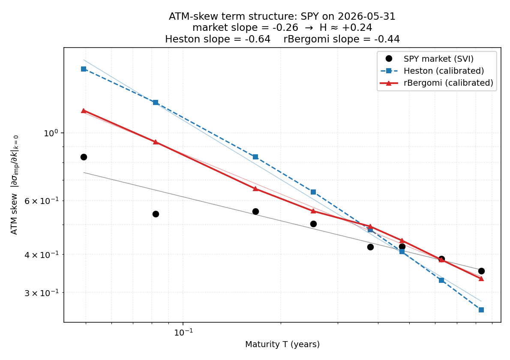

# Heston / Rough Volatility Engine

A production-style equity-derivatives volatility modeling library: side-by-side
calibration of the classical Heston (1993) stochastic volatility model and the
rough Bergomi model of Bayer–Friz–Gatheral (2016) to listed SPX options. The
repo demonstrates rough vol's superior fit to the empirical ATM-skew term
structure decay, prices variance swaps under both models, and includes an
OpenBB-driven backtesting harness that recalibrates and revalues a vanilla
portfolio across many trading days.

## Headline result



The killer plot is `results/figures/atm_skew_term_structure.png` — log-log plot
of ATM skew vs. maturity, with Heston (too flat at long maturities, too steep
at short) and rBergomi (slope ≈ H − 1/2, matching the market decay) overlaid on
real listed-option market data. Regenerate it with `volengine-generate-headline`.
The shipped figure uses SPY (the free-tier yfinance provider has no SPX index
chain); pass `--symbol SPX --provider intrinio` with a paid provider for the
index itself.

## Repo map

```
heston-rough-vol-engine/
├── src/volengine/
│   ├── surfaces/         # implied vol inversion + SVI parameterization
│   ├── models/heston/    # characteristic function, Carr–Madan FFT, Andersen QE
│   ├── models/rbergomi/  # hybrid scheme (Bennedsen–Lunde–Pakkanen), pricing
│   ├── calibration/      # two-stage global + local calibrators
│   ├── products/         # European options, variance swaps
│   ├── analysis/         # ATM skew extraction
│   ├── neural/           # optional NN calibration (stretch)
│   └── backtesting/      # OpenBB data loader + rolling recalibration engine
├── notebooks/            # one notebook per pipeline stage
├── tests/                # pytest suite — every numerical routine has a check
├── data/                 # cached option chain snapshots
└── results/figures/      # generated plots
```

## Quick start

```bash
pip install -e .
pytest                                              # 25 unit tests, ~6 minutes
volengine-benchmark-svi                             # live Phase-1 25-bps check
volengine-backtest --symbol SPY --start 2024-01-02 --end 2024-06-30
```

`volengine-benchmark-svi` is the project's standing Phase-1 acceptance
check — it pulls a live option chain via OpenBB, inverts to implied vols,
fits an SVI slice per maturity, and reports the reprice error in bps of
spot. The Week-1 milestone is mean error under 25 bps on liquid strikes; on
SPY this typically clocks in around 10 bps (see `docs/REFERENCES.md` for
the rationale behind the per-slice variance at short maturities).

## Architecture

The code is organized into eight layered scopes. See
[`docs/ARCHITECTURE.md`](docs/ARCHITECTURE.md) for the full layer diagram,
dependency graph, and extension points.

## Methodology

1. **Data.** SPX option chains are pulled from OpenBB (`obb.derivatives.options.chains`),
   filtered for liquidity (open interest > 100, tight bid-ask), and converted
   to mid prices.
2. **Implied vol.** Black–Scholes IVs are recovered by Brent's method.
3. **Surface fit.** Each maturity slice gets an SVI fit (Gatheral 2004) with
   no-butterfly-arbitrage and no-calendar-arbitrage checks.
4. **Heston calibration.** Two-stage: differential evolution → L-BFGS-B,
   minimizing weighted IV RMSE. The characteristic function uses Albrecher's
   "little Heston trap" form to avoid the branch-cut bug.
5. **Pricing.** Vanillas under Heston via Carr–Madan FFT; Monte Carlo via
   Andersen's QE scheme (Euler-discretized Heston goes negative — never use it).
6. **rBergomi.** The Volterra integral is simulated via the hybrid scheme of
   Bennedsen, Lunde & Pakkanen (2017), then calibrated to the same surface.
7. **Backtest.** A rolling-window harness recalibrates each model on each
   trading day and tracks RMSE, parameter drift, and the model risk spread on
   a held-out portfolio of vanillas.

## Documentation

- [`docs/ARCHITECTURE.md`](docs/ARCHITECTURE.md) — layered scope diagram and extension points.
- [`docs/REFERENCES.md`](docs/REFERENCES.md) — full bibliography.

## References

The full bibliography is in [`docs/REFERENCES.md`](docs/REFERENCES.md). The
non-negotiable papers:

- Heston (1993), *A Closed-Form Solution for Options with Stochastic Volatility*.
- Andersen (2008), *Simple and Efficient Simulation of the Heston Model*.
- Albrecher, Mayer, Schoutens, Tistaert (2007), *The Little Heston Trap*.
- Gatheral & Jacquier (2014), *Arbitrage-free SVI Volatility Surfaces*.
- Bayer, Friz, Gatheral (2016), *Pricing Under Rough Volatility*.
- Bennedsen, Lunde, Pakkanen (2017), *Hybrid scheme for Brownian semistationary processes*.
- Gatheral, Jaisson, Rosenbaum (2018), *Volatility Is Rough*.

## Limitations

- Calibration is to mid-quotes; bid-ask weighting is not implemented.
- Discrete dividends are not modeled — the SPX index assumption (continuous
  dividend yield) is reasonable but not exact for single-name extensions.
- The rBergomi hybrid scheme uses κ = 1; higher κ improves the kernel
  approximation near zero but slows simulation.
- The neural network calibrator is illustrative; production use would need a
  much larger training grid and proper uncertainty quantification.

## License

Apache 2.0 — see [LICENSE](LICENSE).
